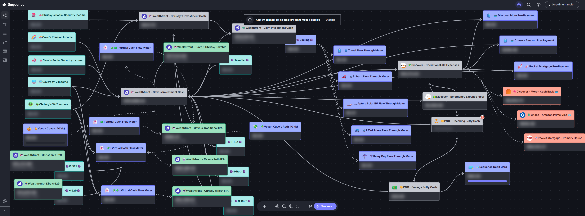

# [Sequence](https://www.getsequence.io/)
I began using Sequence in April 2024. My goal was to automate my retirement cash flows as fully as possible within Sequence. In February 2025 I am happy to say that all my automation procedures were fully realized so that I have not needed to perform any manual transfers.

## Sequence Review
On February 18, 2025 I did a presentation of my Retirement Cash Flow Automation and a review of Sequence capabilities since joining in April 2024. The Power Point presentation is **2025 - My Retirement Cash Flow - Sequence.pptx**.

[Money Map Spotlight with @Cave (2.18.25):](https://us06web.zoom.us/rec/share/Gf86NVkf1ia_2sXWSgKqHwosVproymuPqZfzoPdwX9oQj7WXnT3NZ0FLNfcTE8HT.3_PDxURPYiH5s986?startTime=1739893754000)

Passcode: V=nF1u9V

## New Features

**December 2025** - I began leveraging the Sequence RESTful endpoint that enables account balances to be accessed in real time. I am using this ingested balance data to drive my automated Guyton-Klinger withdrawal decision system.

## Latest Updates

**February 2026** - Changed the layout after a major UI/X update by Sequence and closing RSU account and Morgan Stanley where RSU dividends were posted.

**March 2026** - Changed the layout after closing Voya accounts and rolling over residual 401(k) to Wealthfront IRA.

